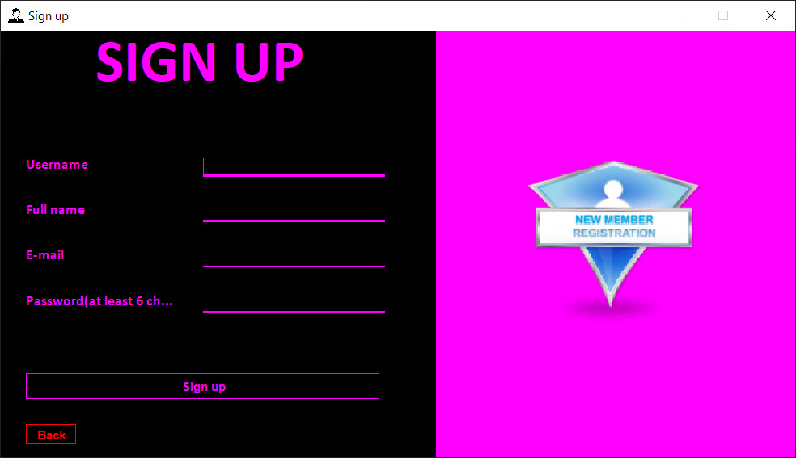
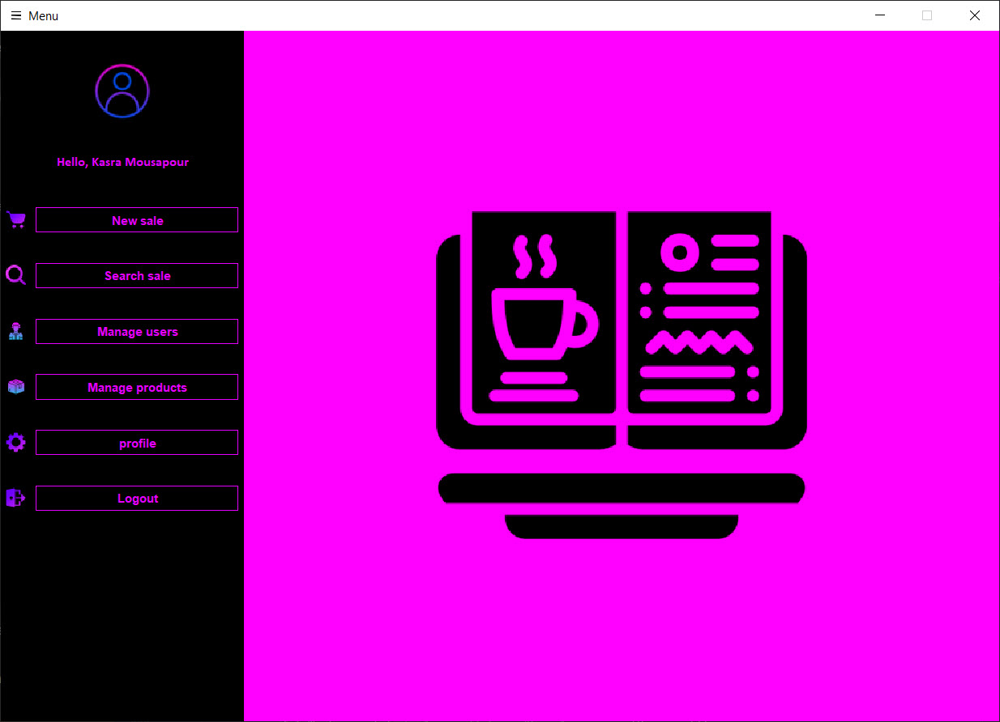
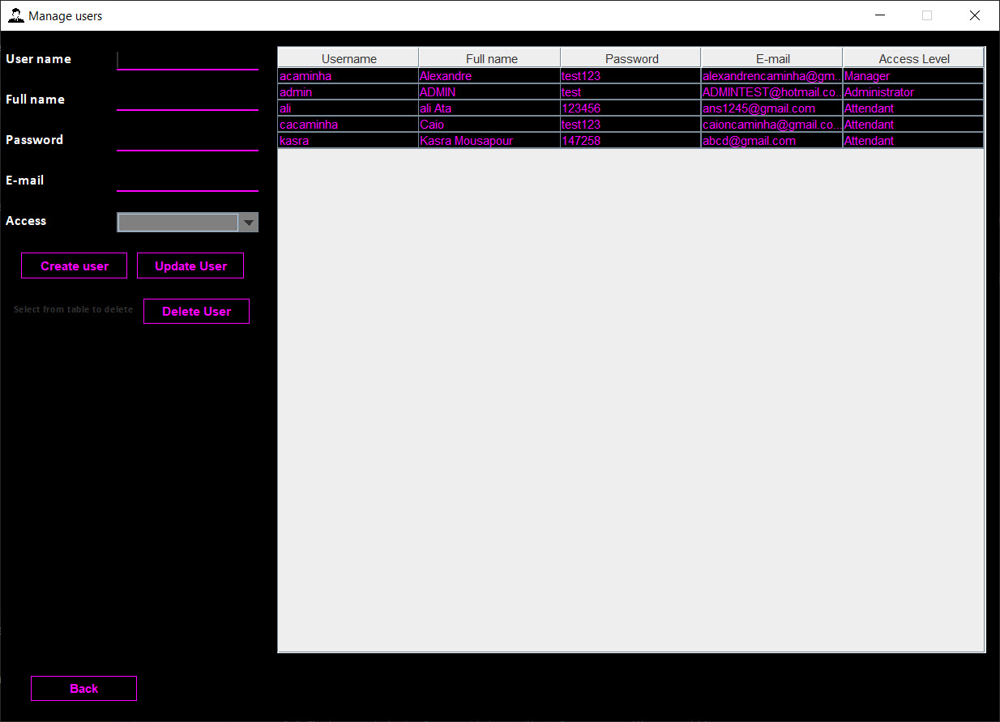
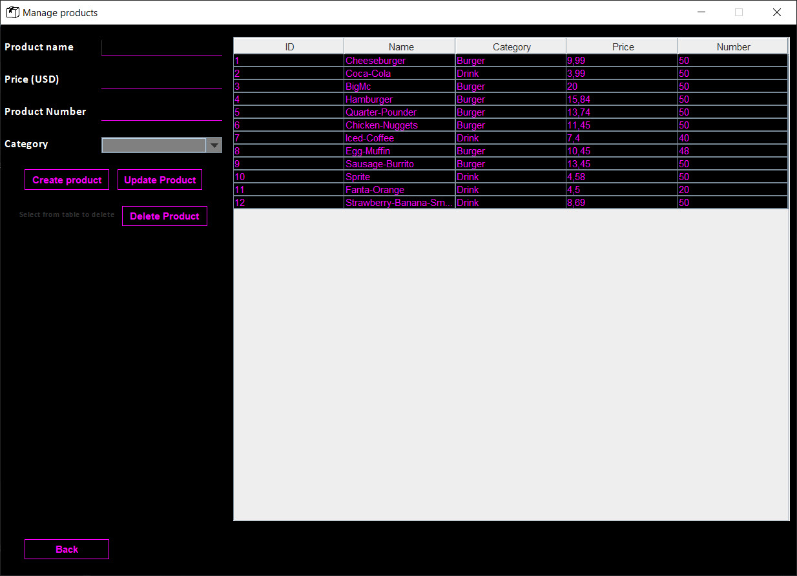
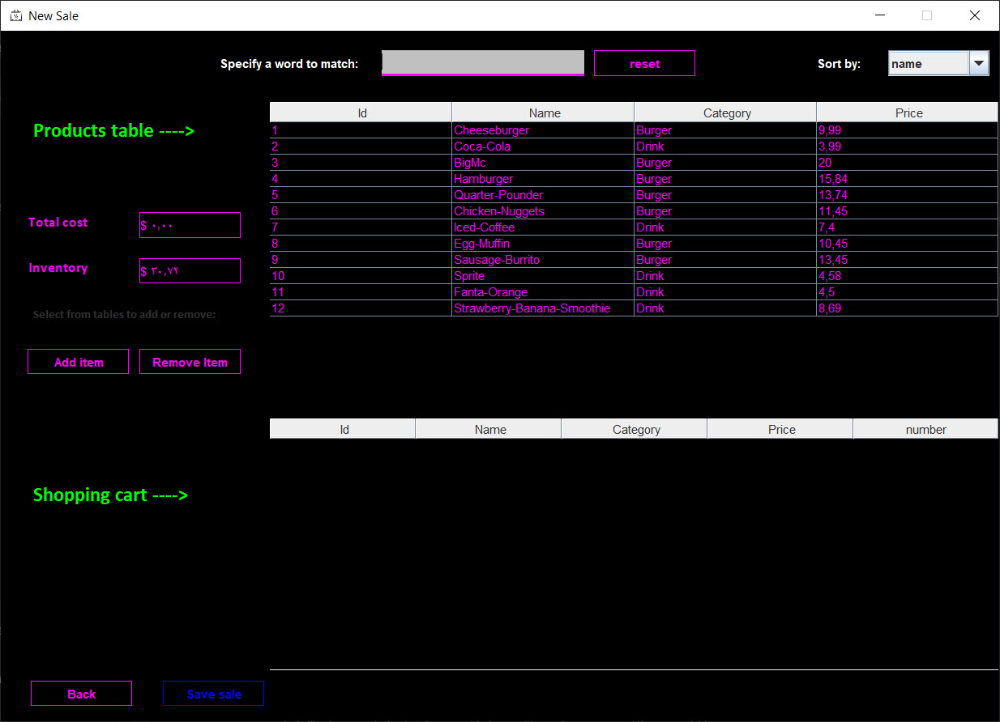
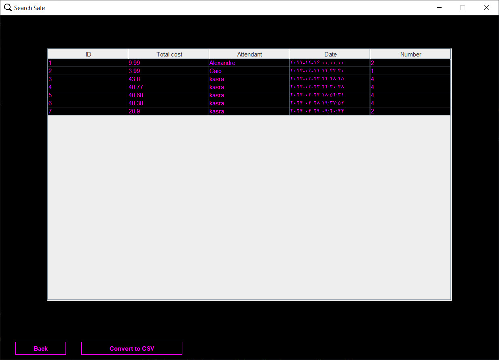

# Java Swing Store Management App
## An application for managing the users and products in a store

---

This project is designed for advanced programming course.

PS: The project was written mainly in the IntelliJ IDEA IDE, but the Swing GUI Forms were not used, instead, all 
GUI components were handwritten.

PPS: The Mavem framework has been added to the project, still, no unit tests were developed for the current build.

---

## Screenshots

### Login

### Sign up

### Menu

### Manage users

### Manage products

### New sale

### Search sale

### Profile

